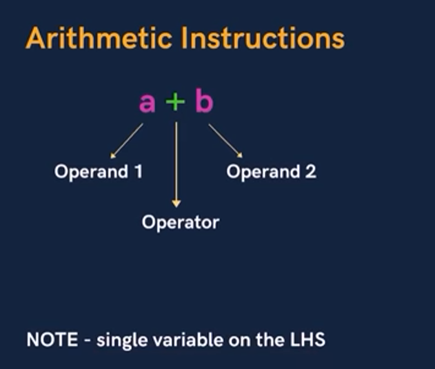
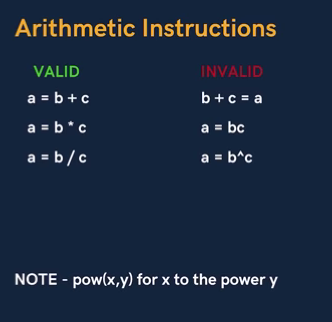
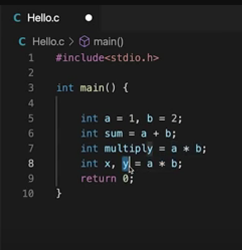
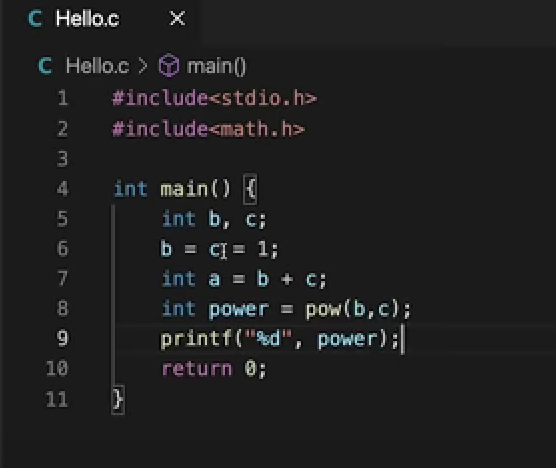
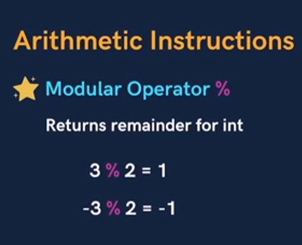

# Arethimatic Operator




Here is the example of Arethimatic Operator


## Pow Operator


## Modular Operator


Modular oprator doesn't work on float value 

**Example**
```
# include<stdio.h>

int maint(){
   printf("%f", 1.1%1.2)
   return 0
}
Output : error
```
if the Numerator is negative the answer is negative otherwise positive
