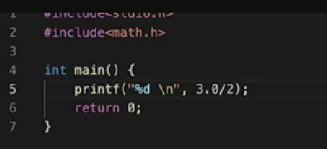

# Type Conversion

if one number is int and other is float than the output is stored in float container by default.

if the Numerator is integer than the answer would be integer

if the Numerator is float than the answer would be float

