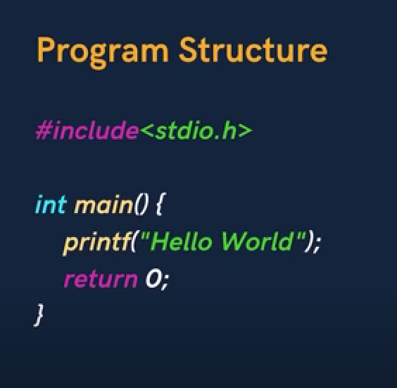

# Structure



A C program basically consists of the following parts
- Preprocessor Commands
- Functions
- Variables
- Statements & Expressions
- Comments

```  
#include <stdio.h>
int main() {
   /* my first program in C */
   printf("Hello, World! \n");
   
   return 0;
}
```
Let us take a look at the various parts of the above program −

- The first line of the program #include <stdio.h> is a preprocessor command, which tells a C compiler to include stdio.h file before going to actual compilation.

- The next line int main() is the main function where the program execution begins.

- The next line /*...*/ will be ignored by the compiler and it has been put to add additional comments in the program. So such lines are called comments in the program.

- The next line printf(...) is another function available in C which causes the message "Hello, World!" to be displayed on the screen.

- The next line return 0; terminates the main() function and returns the value 0.