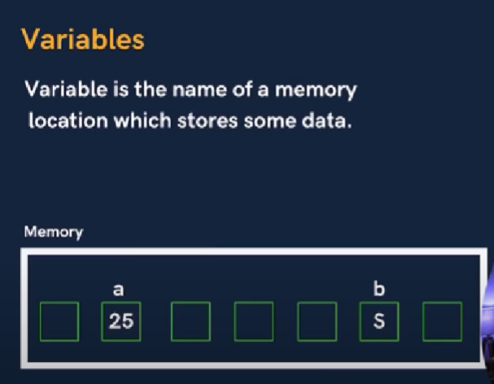

# Variable 
Name of the memory location which store some data

Think of variable as container where we store data 

## Example
- int number = 25
- char start = '*'
- float pi = 3.14

 ## Rule 
- Case sensitive
- 1st Character is alphabet or _
- No comma/black space
- No other symbol other than _